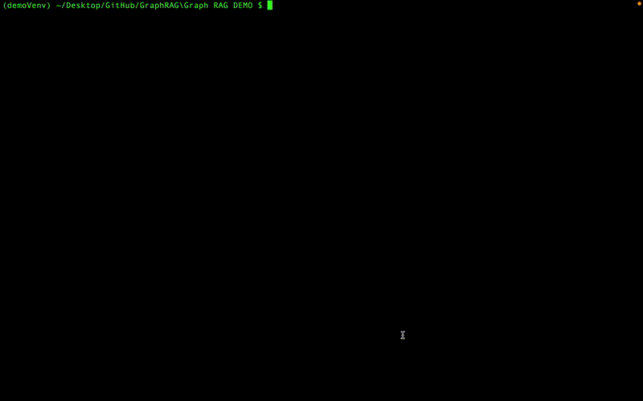
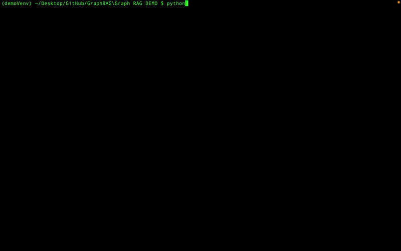
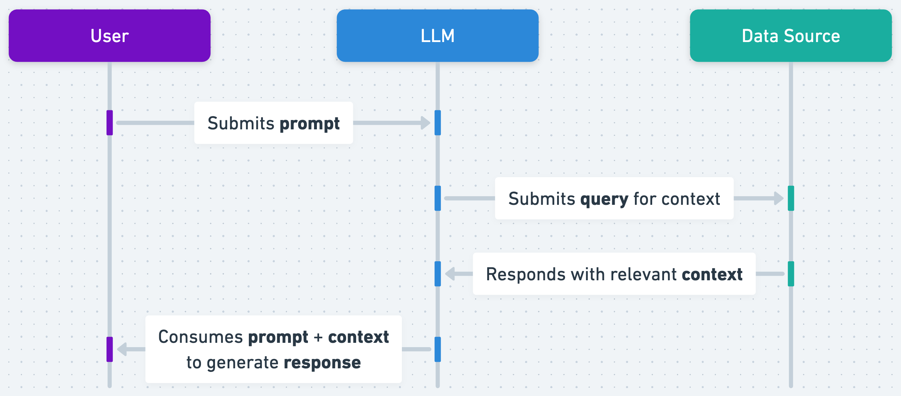

# Graph Based Retrieval Augmented Generation (RAG) Demonstrator

Tool highlighting how a local knowledge source can be used to improve an LLM response.

## LLM Response: RAG and No RAG Comparison

Issue: Prompting a Large Language Model (LLM) with a specific question, in this example "How many actors are in the movie Speed Racer?", can often lead to a lengthy and convoluted answer returned that doesn't directly answer the question.



### Adding RAG to Generate Response

By employing the LLM to generate a relevant query on the database as an intermediate step, the response can provide additional relevant context to the LLM when constructing its final response. This additional context can reduce the likelihood of hallucinations, and improve the quality of the response.



The intermediate step (both generated Cypher query and subsequent response) can be displayed by using the verbose argument when running the tool (`-v`).

## Summary

Graph based RAG is a method that can enhance the response of an LLM by querying relevant data (a knowledge graph summarising various movies in this example) to improve its response quality. This enables more accurate responses from the LLM that are less prone to hallucinations, intermediate query steps can also be used as references within a final response to add confidence. 


*Source: openai.com*

**Note:** The RAG response is still only as good as the data source.

## Tool Features

This tool requires no internet connection to operate and does not share data from the machine it is run on. It highlights  the variation in response when using RAG and when not in generating an LLM response, this can be done simply by adding the `-g` argument when calling the tool from the command line.

Langchain functionality is used to simplify the RAG process, but this could be replaced with hard coded requests to the LLM for readability if preferred.

## Try it yourself

A local neo4j instance should be spun up to use the graph RAG element of the tool, more information to do this can be found here, the user credentials will then need to be modified in [graph_setup.py](graph_setup.py). 

The example shown uses the [Neo4j examples movie dataset](https://github.com/neo4j-graph-examples/movies), but any relevant graph to the line of questioning can be used. Altering the graph, will require the [model_setup.py](model_setup.py) few shot prompt to be amended.

For the LLM, [Ollama](https://ollama.com/) will need to be installed and llama3 downloaded and ready to use, details can be [found here](https://dev.to/timesurgelabs/how-to-run-llama-3-locally-with-ollama-and-open-webui-297d). Other models can be used with the Ollama framework, and will require the [local_llm](local_llm.py) to be updated as necessary. 

Further graph and LLM setup is outside the scope of this demonstrator.
  
  To install the necessary dependencies, run:

  ```bash
  pip install -r requirements.txt
  ```

To run the tool, execute the `main.py` file from the command line, specifying the following parameters:

1. **Input Question** (Required):  
   Provide the question you want the tool to respond to.

2. **Graph Argument (`-g`)** (Optional):  
   If this argument is included, the tool will process the question querying the graph as a source of knowledge.

3. **Verbose Argument (`-v`)** (Optional):  
   If this argument is included, the tool will output the intermediate graph query generated by the LLM and the corresponding response. This is the output used to enrich the final response.

#### Example Command:
```bash
python main.py "How many actors are in the film Speed Racer?" -g -v
```

## Further Work Ideas...

This demonstrator could be extended to develop its capability, some ideas include:

- Use demonstrator as a comparison tool to assess various LLM's Graph RAG capability.
- Productionise code base to enable setup parameters, such as graph, few shot prompt examples and model used to be provided as inputs.
- Add compatibility for other database types.
- Create a custom graph database, which could stretch to pre-process natural language data into a graph format using chunking and embeddings for effective value extraction.


